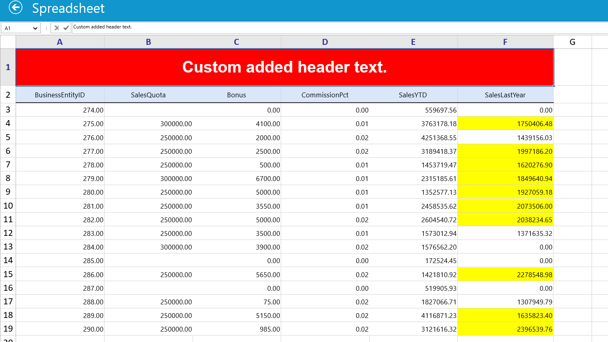
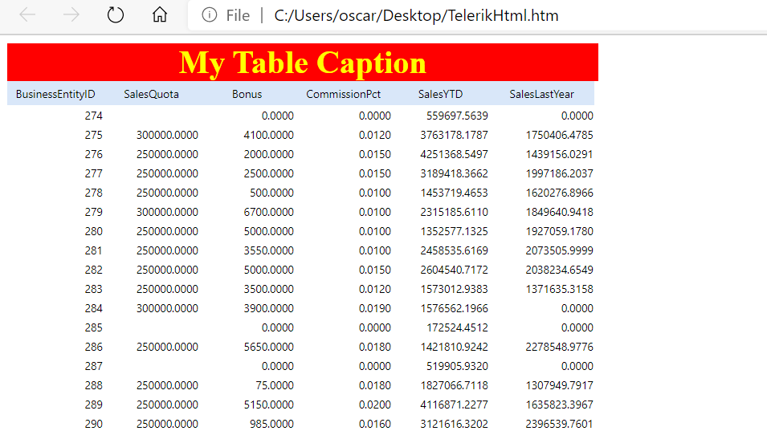

# Telerik Data Export

### Project using Telerik controls to visualize data in a grid view and export it to different formats such as xls, pdf, html and csv. 

## Features
- Data visualization
- Data Binding to grid view
- Use of Telerik Controls
- Data management and export

### Data exported as xls

### Daata exported as pdf

### Data exported as html

### Data exported as csv

